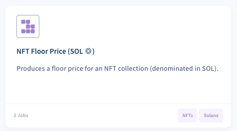
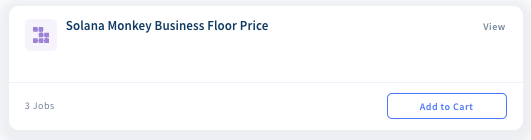
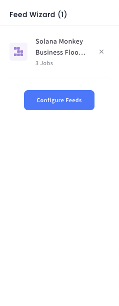
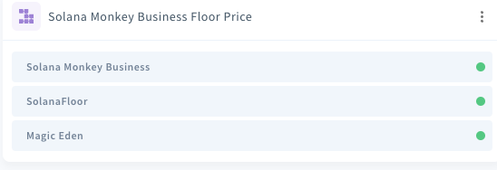
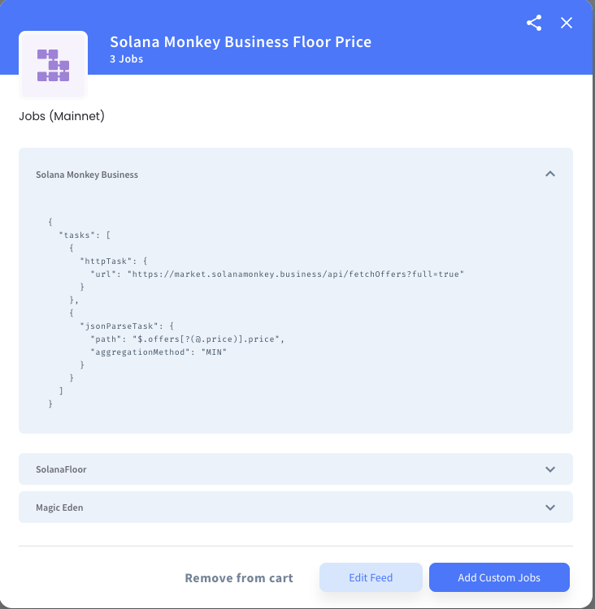
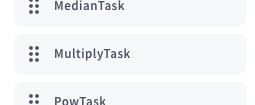
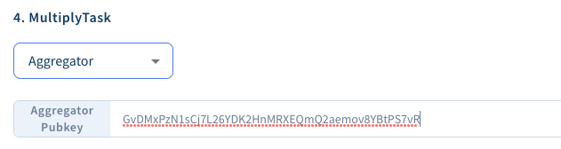
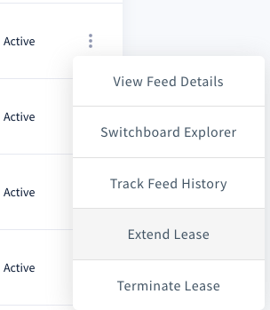
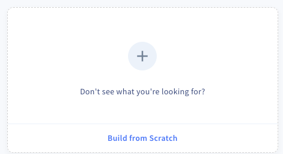

## This is a simple walkthrough of the oracle creation

[Open Switchboard](https://app.switchboard.xyz/)

Click the NFT Oracle starter

Click one of the starter collections. It doesnt matter too much which one is selection, as we are using this as a template

To the right, click configure feeds

Now click the the dots (...) to expand the dropdown and edit the feeds

Next we edit the oracle feed to point to the collection of our choice

The feed is also in USD, not SOL, so we need to supply a multiply task with the aggregator key of the SOL/USD feed to convert to SOL.

Lastly, setup the config of your oracle however you like, or use the Honey specification here.

One the oracle page, we also need to add a 12 hour feed of data storage such that we can do the TWAP in the next step.

Done!

## TWAP Oracle setup

We need to average the price of the collection over the last 12 hours to smooth out the value of collections in times of volatility

This oracle is pretty simpel so we can create from scratch

Then add a TWAP task on the left

Lastly fill out the TWAP config with the aggregator key of your first oracle

Done!

## Now use the TWAP oracle in the creation of your market
