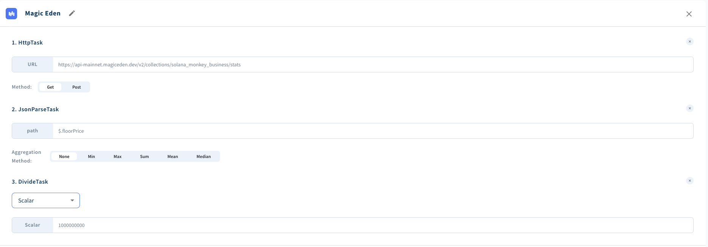
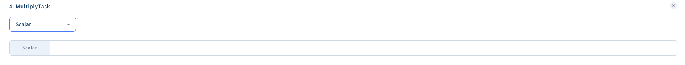
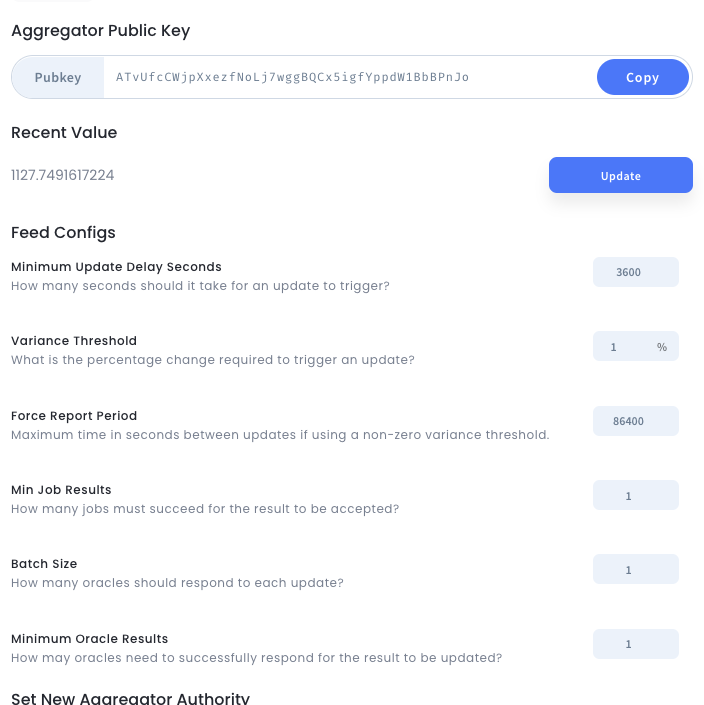
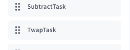
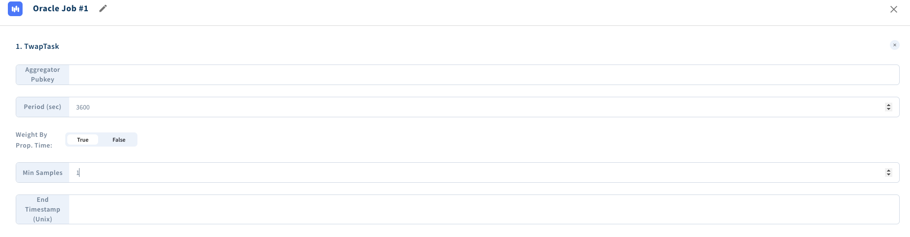

# Floor Price Oracle Creation Workflow

To begin the process [open Switchboard](https://app.switchboard.xyz/) and click on NFT Floor Price (SOL) card in the popular collections list.

1. Click the NFT Oracle starter \
   

2. Click one of the starter collections. It doesnt matter too much which one is selection, as we are using this as a template. \
   But it's possible that your collection is already pre-populated and will make this setup easier. Do a quick search for the name. \
   The idea here is to get a pre-populated outline of what we need to create a floor price feed. You will want to change the name of the feed to the appropriate name + pull from the correct collection name via the api. \
   

3. To the right, click configure feeds \
   

4. Now click the the dots (...) to expand the dropdown and edit the feeds \
   

5. Next we edit the oracle feed to point to the collection of our choice \
   

6. Here is where you an edit the collection name if needed. For example, the URL should be replaced with \
   <b>https://api-mainnet.magiceden.dev/v2/collections/(your collection name on MagicEden)/stats</b> \
   You can find this collection name by going to [MagicEden](https://magiceden.io/popular-collections) and looking for your collection. \
   Once you click on the MagicEden market you will have a url with the collection name in it. \
   <b>https://magiceden.io/marketplace/claynosaurz</b> Take the 'claynosaurz' equivalent for your use. \
   

7. The feed is also in SOL, not USD, so we need to supply a multiply task with the aggregator key of the SOL/USD feed to convert to SOL. \
   
   
   <b>NOTE: </b> You can find the SOL / USD aggregator feed [here](https://switchboard.xyz/explorer/3/GvDMxPzN1sCj7L26YDK2HnMRXEQmQ2aemov8YBtPS7vR). This is the generic one run by the switchboard community. \
   

8. Lastly, setup the config of your oracle however you like, or use the Honey specification here. \
    <b>NOTE:</b> We will need to copy the Aggregator public key from the 'View Feed Details' page for use with the TWAP oracle later.
   

9. One the oracle page, you also need to add a 12 hour feed of data storage such that we can do the TWAP in the next step. \
   This is done by opening the 'Track Feed History' tab shown below and moving the slider to 12 hours. \
   

Done!

# TWAP Oracle setup

### We need to average the price of the collection over the last 12 hours to smooth out the value of collections in times of volatility

1. This oracle is pretty simple so we can create from scratch \
   

2. Then add a TWAP task on the left \
   

3. Lastly fill out the TWAP config with the aggregator key of your first oracle \
   

Done!

## Now use the TWAP oracle in the creation of your market
